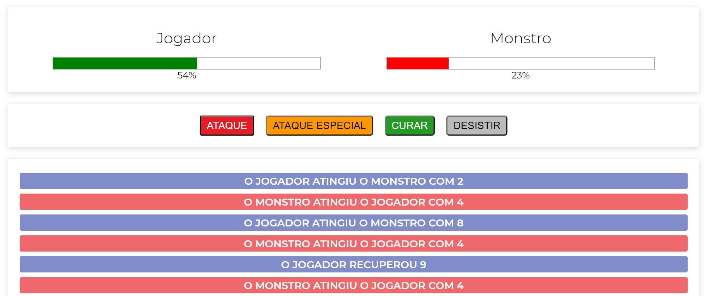

<h1 align="center">
  :space_invader: Monster Killer
</h1>

- **Project proposed by:** [Cod3r](https://www.cod3r.com.br/)
- **Project developed by:** [Julio L. Muller](https://github.com/juliolmuller)
- **Released on:** Apr 4, 2020
- **Updated on:** Apr 4, 2020
- **Latest version:** 1.0.0
- **License:** MIT

Frontend web application developed to apply knowledge in Vue.js (non-CLI structure). This project was proposed and developed in [Cod3r's Udemy course](https://www.udemy.com/course/vue-js-completo/), very nice and recommended. It is a single-player game to fight a monster using different hits with random effects.

[Check out the application running!](https://juliolmuller.github.io/monster-killer/)

## :trophy: Lessons Learned

- Recalling how to build non-CLI Vue applications;
- GEtting random numbers within a range;
- Practicing CSS styles;

## :hammer: Technologies & Resources

**Frontend:**
- HTML, CSS & JavaScript
- Vue.js 2

**Development:**
- Visual Studio Code

## :zap: Features

- SPA (single page application);
- Single-player game;
- Friendly UI;
